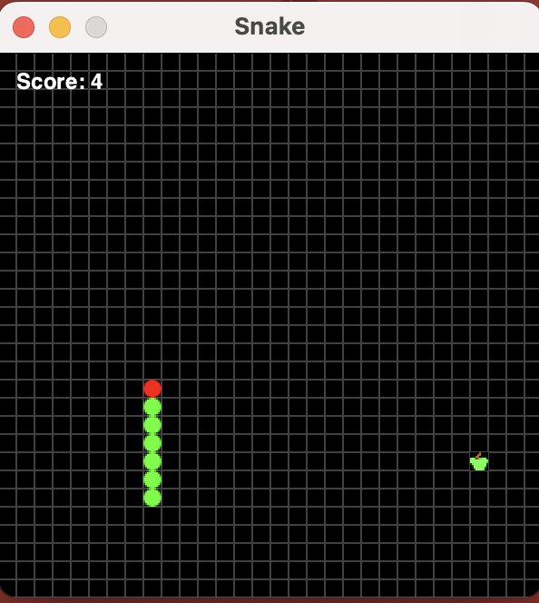

# 🐍 Java Snake Game

A simple and classic **Snake Game built using Java Swing** — customized with grid visuals, score display, and pause functionality. Perfect for beginners learning game development or Java GUI fundamentals.

<p align="center">
  
</p>

---

## 🛠️ Features

- 🎮 Keyboard-controlled snake (arrow keys)
- 🍎 Random apple generation
- 🔢 Score display on screen
- ⏸️ Pause & Resume (press **P**)
- 🎨 Grid-style game board
- 💡 Easily extendable with more features!

---

## 🚀 How to Run

### 💻 Prerequisites
- Java JDK 8 or above
- Terminal or IDE (VS Code, IntelliJ, etc.)


### ▶️ Run via Terminal

```bash
cd src
javac com/aishwarya/*.java
java com.aishwarya.Snake
```

📄 License
    
  This project is based on Jan Bodnar's Snake Game Tutorial and is licensed under the BSD 2-Clause License.

  © 2020 Jan Bodnar
  Modified and extended by Aishwarya Kailas
